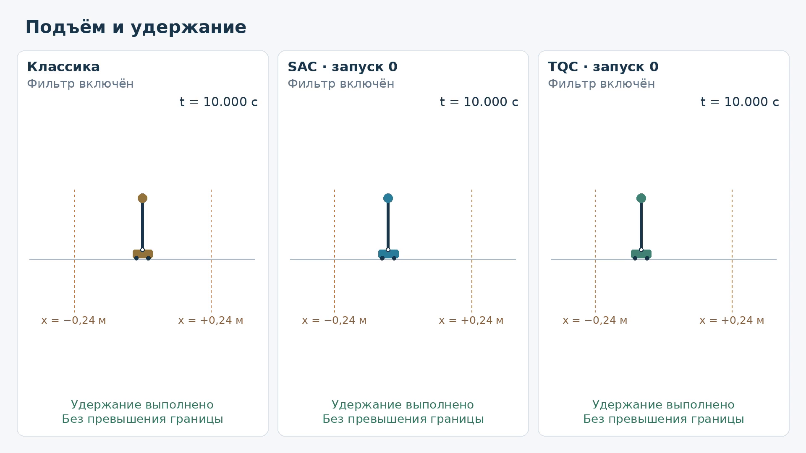
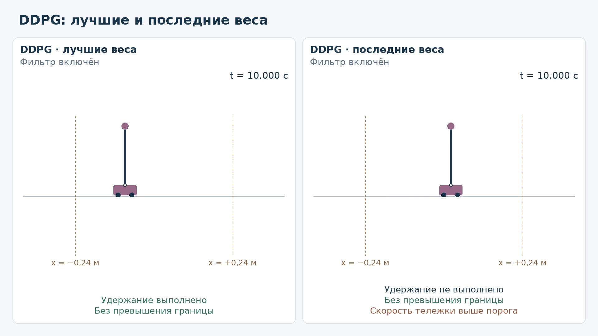
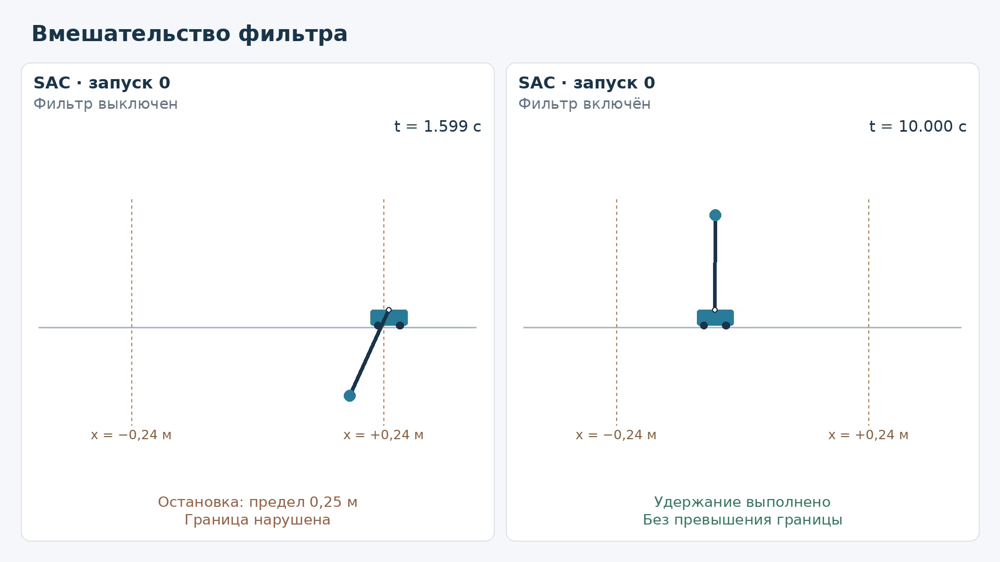
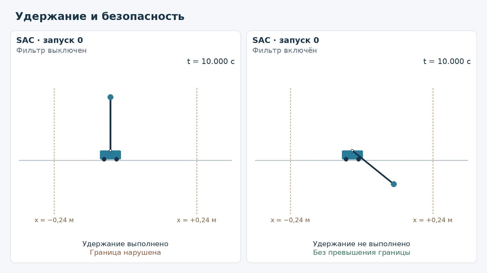
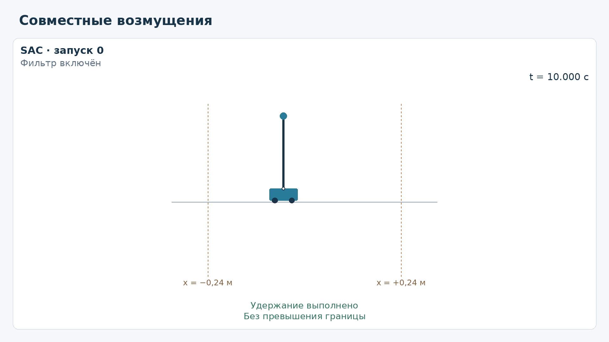
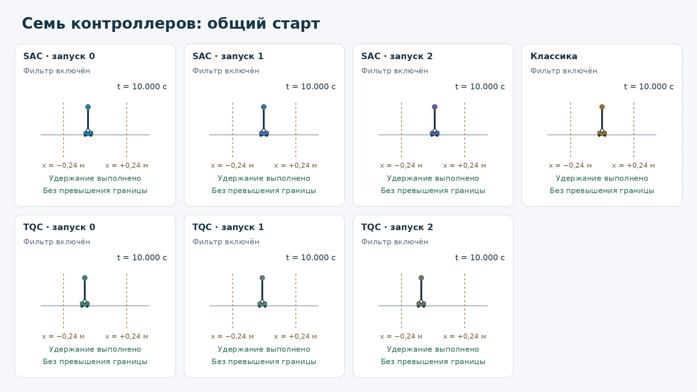

# Управление перевёрнутым маятником методами обучения с подкреплением

**Дмитрий Нефедов, НИУ ВШЭ, ПМИ, группа БПМИ-233.**
Научный руководитель: **Бондарев Андрей Олегович**.

Локальный комплект индивидуальной исследовательской курсовой: код, закреплённые
конфигурации, проверенные компактные данные и материалы для комиссии.
[Отчёт-кандидат (PDF, 37 страниц)](docs/report/report.pdf) ·
[Электронные приложения](docs/APPENDICES.md) · [Воспроизводимость](REPRODUCIBILITY.md).
Публичный репозиторий пока не создан; промежуточный PDF не считается окончательно одобренным.

## Задача и модель

Поднять маятник из нижней области и удержать около верхней вертикали, сохраняя
ограничения движения тележки. В модели вход — ускорение тележки u, не сила:
`x''=u`, `theta''=(-g*sin(theta)-u*cos(theta))/l`, g=9.8 м/с², l=.18 м.
Угол 0 направлен вниз, pi — вверх. Drake RK3, dt=.01 с, accuracy=1e-6;
горизонт 10 с. Это симуляционное исследование; аппаратных испытаний нет.

SAC, TQC, DDPG, DQN и классический траекторный регулятор используют общий
протокол. Фильтр корректирует запрос с учётом положения, скорости и тормозного
запаса; желаемая граница ±.24 м отличается от физического события ±.25 м.
Рабочие пределы |u|≤4 м/с² и |v|≤2 м/с. Он не заменяет цель подъёма и удержания.
Успех требует полного горизонта и последних непрерывных 2 с в области
|ошибка угла|≤10°, |omega|≤.5 рад/с, |x|≤.20 м, |v|≤.20 м/с, по отсчётам.
[Подробный контракт](docs/PROTOCOL.md).

## Основные наблюдения

**Основная серия, best, evaluation filter-on; успехи из 20 validation-состояний
для seeds 0 / 1 / 2** (три named-сценария не входят в selection):

| Обучение | seed 0 | seed 1 | seed 2 |
|---|---:|---:|---:|
| SAC-on | 20/20 | 20/20 | 20/20 |
| TQC-on | 20/20 | 20/20 | 20/20 |
| DDPG-on | 20/20 | 0/20 | 0/20 |
| DQN-on | 20/20 | 14/20 | 20/20 |
| SAC-off | 0/20 | 0/20 | 0/20 |

Stage 1: warmup5000 выбран по заранее заданному лексикографическому правилу
для DDPG-on и SAC-off, но minimum success по seeds0/1/2 остался нулевым.
Confirmation на новых seeds3/4/5 **не пройден обеими конфигурациями**.
Все 33 обучения и неудачные seeds сохранены в компактных таблицах.
Раннее посещение верха SAC-off не подтвердило диагностическую гипотезу механизма.
[Точные результаты и критерии](RESULTS.md).

**Structured robustness:** семь фиксированных контроллеров (SAC/TQC seeds0–2 и
classical), 140 общих стартов, семь групп, filter off/on; 1960 эпизодов, 980 пар.

| Метрика | off (980 эпизодов) | on (980 эпизодов) |
|---|---:|---:|
| Успешное финальное удержание | 441 (45.00%) | 796 (81.22%) |
| Превышение ±.24 м с допуском | 585 (59.69%) | 0 |
| Достижение горизонта | 446 | 980 |
| Горизонт достигнут, удержание неуспешно | 5 | 184 |

Это конечный development-набор, не независимый final5000 и не доказательство
глобальной устойчивости. Наблюдаемая безопасность и решение задачи различаются.
[Аудированные результаты](docs/ROBUSTNESS_RESULTS_DRAFT.md),
[таблицы и пять графиков](docs/assets/structured_robustness/README.md).

## Шесть видео из сохранённых журналов

Выбранные траектории иллюстрируют поведение, а не оценивают вероятность успеха.
Клик по постеру открывает MP4. Видео и постеры перенесены без перекодирования.

### В1. Nominal: SAC, TQC и классика

[](media/01_nominal_controllers.mp4)

### В2. DDPG: best и деградировавший last

[](media/02_ddpg_best_vs_last.mp4)

### В3. Фильтр предотвращает выход тележки

[](media/03_filter_safety_rescue.mp4)

### В4. Успех и безопасность — разные критерии

[](media/04_success_vs_safety.mp4)

### В5. Отклонения начального состояния

[](media/05_robustness_groups.mp4)

### В6. Сравнение закреплённых контроллеров

[](media/06_final_controllers.mp4)

[Описание отбора](media/README.md) · [QA](media/QA_REPORT.md) · [SHA](media/VIDEO_MANIFEST.json).
Исторические команды рендера в media требуют внешних исходных логов; ссылки на MP4
и постеры работают из этого комплекта. Новых rollout при подготовке не было.

## Состав и быстрый старт

| Каталог | Содержание |
|---|---|
| `cartpole/`, `configs/` | Физика, среда, методы, фильтр, frozen-конфигурации, анализ и рендер |
| `tests/` | Регрессии и небольшие необходимые fixtures |
| `results/tables/` | Main, Stage 1, confirmation; без полных episode logs |
| `results/robustness/` | Нормализованные метрики 1960 эпизодов, без state/action traces |
| `docs/assets/structured_robustness/` | Канонические таблицы, анализ и PNG/SVG |
| `media/` | Шесть MP4, постеры, принятые manifest/QA |
| `docs/report/` | Неизменённый PDF, LaTeX, данные и рисунки автономного отчёта |
| `models/` | Шесть настоящих main-best SAC/TQC inference-комплектов |
| `provenance/` | Источники, исторические manifests, актуальные SHA |

Лёгкие проверки требуют только Python; не загружают модели, torch или Drake:

```bash
python3 -B -m scripts.reproduce_results --check
python3 -B -m scripts.reproduce_robustness --check
python3 -B -m scripts.verify_submission
python3 -B docs/report/scripts/check_report.py
```

Для тестов, графиков и inference проверен Linux x86_64 / Python 3.12.3:

```bash
python3.12 -m venv .venv
.venv/bin/python -m pip install -r requirements.txt
.venv/bin/python -m pip install --no-deps --no-build-isolation -e .
.venv/bin/python -m pip check
.venv/bin/python -B -m scripts.frozen_inference --load-check
```

Последняя команда только загружает шесть моделей и сверяет сохранённые пробы,
без шага среды. [Запуск политики, графики, обучение и raw-аудит](REPRODUCIBILITY.md)
разделены по требованиям и фактически выполненным проверкам.

## Ограничения и происхождение

Мало training seeds, общие старты, узкий validation lower-box и конечная матрица
stress. У classical есть документированный `known_mismatch` provenance между
specification и фактическим environment contract. Он не скрыт и не означает
идентичность всех интерфейсов. Нет аппаратной валидации и проверки final5000.
[Ограничения](docs/LIMITATIONS.md) · [Проверки комплекта](docs/CHECKS.md).

Основа — лабораторный [robotics-laboratory/cart-pole](https://github.com/robotics-laboratory/cart-pole),
ветка linear-stable. История и авторство сохранены. SAC/TQC — существующие методы,
а не новые алгоритмы этой работы. [Происхождение и права](THIRD_PARTY_NOTICES.md).
Лицензия upstream локально не найдена; разрешение на публичное распространение
нужно уточнить. Новая лицензия на чужой код не назначена.

OpenAI Codex существенно помогал с кодом, аудитами, тестами, текстом и оформлением;
иллюстрация установки сгенерирована ИИ и подписана в отчёте. Измеренные результаты
происходят из сохранённых экспериментов. Ответственность за содержание несёт автор.
[Полное раскрытие помощи](docs/AI_USE.md).
