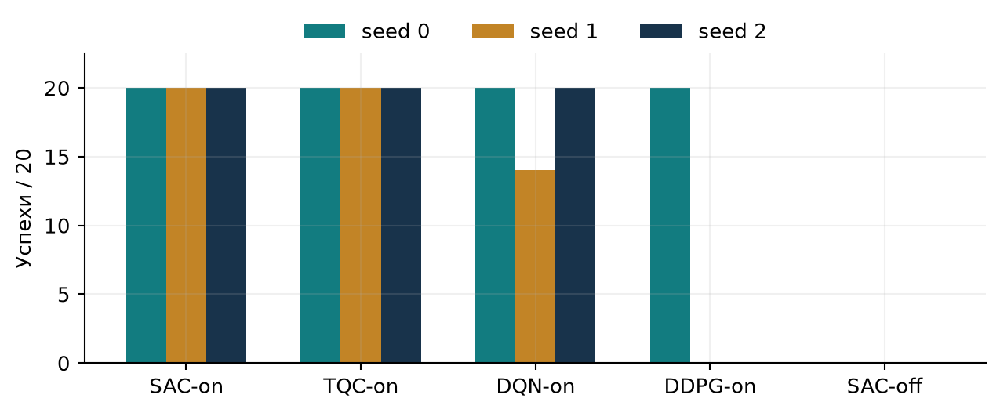

# Подъём и удержание перевёрнутого маятника

Промежуточные результаты исследовательской курсовой ПМИ НИУ ВШЭ.
Автор: Дмитрий Нефедов. Руководитель: Андрей Олегович Бондарев.

Тележка должна поднять свободно висящий маятник и удержать его сверху, не выходя
за рабочие границы. Здесь сравниваются траекторный контроллер с LQR и четыре
метода обучения с подкреплением: SAC, TQC, DDPG и DQN. Общий фильтр ограничивает
ускорение по состоянию тележки. Работа выполнена в симуляции Drake;
управление реальным оборудованием в эту версию не входит.



SAC-on и TQC-on успешны на трёх seeds основной серии в узком validation-протоколе.
DDPG и SAC-off зависят от seed и checkpoint. Увеличение начального сбора опыта
выиграло development-отбор, но не подтвердилось на seeds 3/4/5.
Безопасная траектория тележки сама по себе не означает подъём и удержание маятника.

- [Промежуточный отчёт, PDF](docs/report/report.pdf) и [LaTeX](docs/report/report.tex).
- [Все результаты, включая неудачи](RESULTS.md).
- [Модель](docs/MODEL.md), [протокол](docs/PROTOCOL.md), [ограничения](docs/LIMITATIONS.md).
- [Четыре видео с происхождением](media/README.md).
- [Воспроизводимость и контрольные суммы](REPRODUCIBILITY.md).
- [Structured robustness: только подготовленный протокол](docs/ROBUSTNESS.md).

## Установка и короткая проверка

Linux x86_64, Python 3.12 (проверенная версия 3.12.3). Установка создаёт отдельную
CPU-среду. Для отображения готовых MP4 Python не нужен.

```bash
python3.12 -m venv .venv
.venv/bin/python -m pip install -r requirements.txt
.venv/bin/python -m pip install --no-deps --no-build-isolation -e .
MPLBACKEND=Agg .venv/bin/python -B -m unittest discover -s tests -p 'test_submission.py' -v
.venv/bin/python -B -m scripts.verify_submission
.venv/bin/python -B -m scripts.reproduce_results --check
```

Эти команды не обучают модели и не выполняют rollout. Дополнительные адресные
проверки фильтра и inference описаны в [воспроизводимости](REPRODUCIBILITY.md).
Примеры явного запуска оценки опубликованы там же; при подготовке submission они
не исполнялись. Checkpoints в репозиторий не включены.

## Происхождение

Основа — [robotics-laboratory/cart-pole](https://github.com/robotics-laboratory/cart-pole),
ветка `linear-stable`. Её история сохранена. На неё наложен отобранный снимок
исследовательского кода `96332cf7a15ada8f65ef1efb5203f630b084ef0d`; математический
контракт и исходники научной части не изменены.
[Условия использования и attribution](THIRD_PARTY_NOTICES.md),
[раскрытие помощи генеративных моделей](docs/AI_USE.md).

Это локальный кандидат для просмотра перед публикацией. Новые final/stress
эксперименты при его подготовке не проводились.
