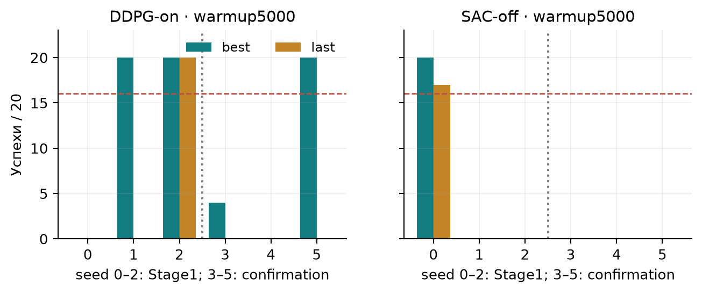

# Проверенные промежуточные результаты

Таблицы ниже — пересчёт из компактных таблиц ранее завершённых независимых аудитов.
При подготовке submission новые rollout не выполнялись. CSV включают все seeds,
best/last и evaluation off/on, а не только удачные примеры.

## Основная серия

**Validation20**, evaluation filter-on; три числа означают seeds0/1/2.
Training filter указан в названии метода. Named3 в эти числа не входят.

| Метод | Best, успехи из20 | Last, успехи из20 |
| --- | --- | --- |
| SAC_on | 20 / 20 / 20 | 20 / 20 / 20 |
| TQC_on | 20 / 20 / 20 | 20 / 20 / 20 |
| DDPG_on | 20 / 0 / 0 | 20 / 0 / 0 |
| DQN_on | 20 / 14 / 20 | 11 / 14 / 20 |
| SAC_off | 0 / 0 / 0 | 0 / 0 / 0 |
| Классика, filter-on | 20/20 (один фиксированный контроллер) | не применимо |

SAC-on/TQC-on и классика решают задачу в данном узком протоколе. У DDPG сильная
зависимость от seed; SAC-off baseline неуспешен. Отдельные off/on результаты
приведены в [main CSV](results/tables/main/evaluation_summary.csv). Для named3
есть самостоятельные строки subset=named; строки subset=all описательны.

## Development и confirmation

Здесь evaluation выполняется **в training filter mode**: DDPG-on с фильтром,
SAC-off без него. Выбор только по20 validation states.

| Вариант Stage1 | Best по seeds0/1/2, из20 |
| --- | --- |
| ddpg_on_warmup5000 | 0 / 20 / 20 |
| ddpg_on_lr1e4 | 0 / 13 / 0 |
| sac_off_warmup5000 | 20 / 0 / 0 |
| sac_off_lr1e4 | 0 / 0 / 0 |

Ключ отбора: `(min success_rate, mean success_rate, min mean final hold, mean mean final hold, mean mean longest hold)`. Полные вычисленные значения:

**DDPG_on**

- `ddpg_on_baseline`: `(0.0, 0.3333333333333333, 0.0, 2.3385000000000002, 2.3385000000000002)`
- `ddpg_on_warmup5000`: `(0.0, 0.6666666666666666, 0.0, 4.705, 4.705)`
- `ddpg_on_lr1e4`: `(0.0, 0.21666666666666667, 0.0, 0.9248333333333333, 0.9271666666666666)`
**SAC_off**

- `sac_off_baseline`: `(0.0, 0.0, 0.0, 0.0, 0.0736666666666667)`
- `sac_off_warmup5000`: `(0.0, 0.3333333333333333, 0.0, 2.0113333333333334, 2.1261666666666668)`
- `sac_off_lr1e4`: `(0.0, 0.0, 0.0, 0.0, 0.0013333333333333346)`

Warmup5000 — строгий лексикографический победитель у обоих методов; minimum success
остаётся нулём. Это не означает устойчивость. Для SAC-off отдельная гипотеза
механизма (top coverage к20k улучшится хотя бы у2 из3 seeds) не получила поддержки.
Сравнение настроенного SAC-off с ненастроенным SAC-on не является новым чистым
контролируемым сравнением влияния фильтра.

Confirmation сохранил параметры и проверил training seeds3/4/5 на прежнем roster:

| Вариант | Best, из20 | Last, из20 | Gate |
| --- | --- | --- | --- |
| ddpg_on_warmup5000 | 4 / 0 / 20 | 0 / 0 / 0 | не пройден |
| sac_off_warmup5000 | 0 / 0 / 0 | 0 / 0 / 0 | не пройден |

Gate требовал у каждого best≥0.8 и минимум у двух last≥0.8. **Оба варианта не
подтверждены.** DDPG seed5 демонстрирует деградацию best→last; одна удачная модель
не скрывает остальных seeds. Новое обучение или автоматический дополнительный
бюджет по этим данным не назначены.

Источники: [Stage1 CSV](results/tables/stage1/evaluation_summary.csv),
[confirmation CSV](results/tables/confirmation/evaluation_summary.csv),
[точный selection](results/tables/stage1/selection_audit.json),
[confirmation gate](results/tables/confirmation/confirmation_gate.json),
[пересчитанные значения](results/tables/reproduced.json).
SHA моделей и выбранные поколения: [main](results/tables/main/selected_checkpoints.csv),
[Stage1](results/tables/stage1/selected_checkpoints.csv),
[confirmation](results/tables/confirmation/selected_checkpoints.csv).
Техническое принятие main TQC seed1 было закрыто позже; отрицательная старая
квитанция не переписана. Это не изменение его научных результатов.

[Ограничения](docs/LIMITATIONS.md) не позволяют переносить эти результаты на
произвольные состояния. Structured robustness только подготовлен, final не использован.
